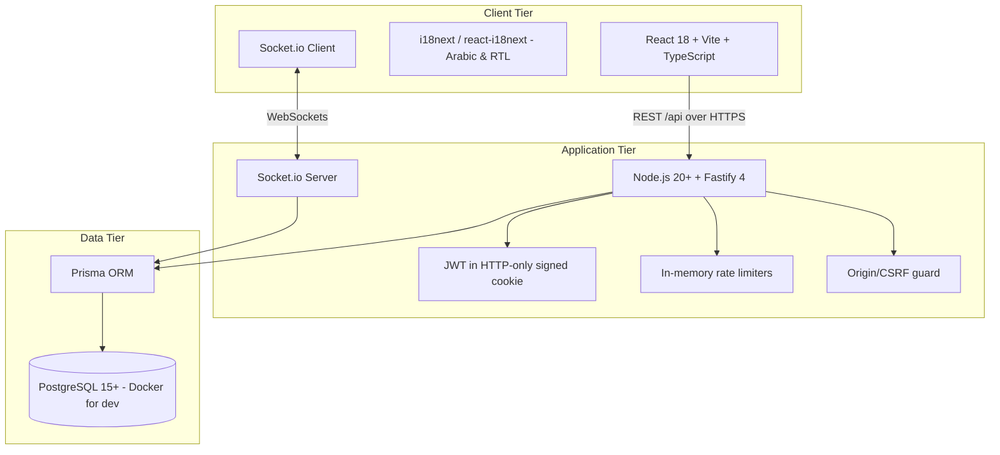
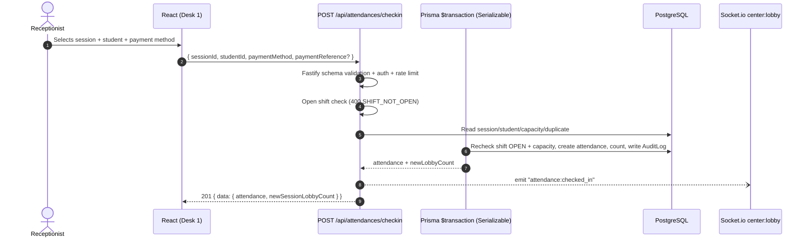

# Technical Architecture: Educational Center ERP

> This document describes the **actually implemented** architecture (derived from `src/`, `prisma/`, `package.json`, and the deployment files). Design language: Arabic-first, RTL-native, Fastify + React + PostgreSQL via Prisma.

## 1. Overview & Architecture Drivers

1. **Fast Door Operations:** Arabic-normalized student lookup and one-click check-in during rush hour workloads.
2. **Concurrent Multi-Desk Check-In:** Several receptionists on separate terminals stay in sync in real time via Socket.io (`center:lobby` room).
3. **Strict Concurrency Guard:** A database `UNIQUE (session_id, student_id)` constraint makes duplicate check-ins mathematically impossible; the application additionally checks first and maps `23505`/`P2002` to `409`.
4. **Isolated Shift Cash Drawers:** Per-receptionist desk registers, with separate tallies for Cash, Vodafone Cash and InstaPay.
5. **Auditable Financial Integrity:** Completed sessions and closed shifts are locked; every business mutation is written inside the same transaction that creates its `AuditLog` entry.
6. **Arabic-First Experience:** Native RTL UI (Cairo font), `normalizeArabicText` phonetic normalization shared between client and server.

---

## 2. Technology Stack



| Layer | Technology | Notes |
| :--- | :--- | :--- |
| Language | TypeScript (strict) | `tsconfig.json` (client, `noEmit`), `tsconfig.server.json` (NodeNext, emits `dist/server`). |
| Frontend | React 18 + Vite 5 + Tailwind CSS + Lucide | SPA; `App.tsx` shows `LoginPage` or `AppShell`. |
| Localization | `i18next` + `react-i18next` | `ar` default, `en` secondary; Header language toggle flips `dir`. |
| Client state | Local component state (`useState`) | `@tanstack/react-query`, `zustand`, and `zod` are **installed but not yet used** (server validation stays on Fastify JSON Schema). |
| Backend | Fastify 4 (`app.ts`, `server.ts`) | `fastify.inject` used in tests; plugin registration with `prefix` per module. |
| Real time | Socket.io 4 (`src/server/lib/socket.ts`) | Auth middleware + `center:lobby` room. |
| DB + ORM | PostgreSQL 15 + Prisma 5 | `postgresqlExtensions` preview, `pg_trgm`/`unaccent`/`pgcrypto`. |
| Validation | Fastify JSON Schema (server) | `additionalProperties: false`; client uses manual inline checks. |
| Password hashing | Argon2id (`argon2`) | 64 MiB, time cost 3, parallelism 4 (see `prisma/seed.ts`). |

---

## 3. Frontend Architecture

### 3.1. Structure & State Management

```
src/client/
├── main.tsx, App.tsx, index.css
├── auth/                    # AuthContext + LoginPage (useAuth cookie-based)
├── components/
│   ├── layout/              # AppShell, Header, Sidebar, DeskStationBadge, StatusAlerts
│   └── ui/                  # AsyncState (Loading/Empty/Error), popovers, etc.
├── features/
│   ├── navigation/          # navigationItems.ts (lobby, sessions, students, teachers,
│   │                        #   rooms, shift, reconciliation, settlement, reports)
│   ├── management/          # ManagementPage (rooms + teachers CRUD, ADMIN)
│   ├── operations/          # OperationsPage: lobby | shift | reconciliation | settlement | reports
│   ├── scheduling/          # SchedulingPage (sessions CRUD, ADMIN)
│   └── students/            # StudentsPage (search, quick-add, edit)
└── locales/                 # i18n dictionaries (ar/, en/) + i18n.ts
```

- **Lobby** (`operations`): session cards, Arabic-normalized student search, check-in with the 3 payment methods and digital reference capture, live `attendance:checked_in` subscription via `io({ withCredentials: true })` + `join:lobby`.
- **Shift**: open/close drawer, live expected-cash financials, record expenses, variance display.
- **Reconciliation / Settlement / Reports**: session action forms and the daily report + shift audit log viewer.
- The UI does **no financial arithmetic**; it renders values returned by the server.

### 3.2. Keyboard & Rush-Hour UX (implemented)
- Lobby student search field is auto-focused on mount.
- Enter/click performs the check-in; duplicate check-in and capacity errors surface as inline notices.
- Global hotkeys (F1, Alt+N, Alt+1/2/3, chimes) and thermal printing are **planned, not implemented**.

### 3.3. Arabic-First & RTL
- The app mounts with `dir="rtl"` / `lang="ar"` by default; the Header language toggle switches to `en`/`ltr`.
- Typography: Google **Cairo** font; currency formatted for `ar-EG` / EGP.
- Phonetic search: shared utility `src/shared/utils/arabicNormalization.ts` (strips tashkeel + tatweel, unifies `أ/إ/آ → ا`, `ة → ه`, `ى → ي`, collapses spaces, lowercases). On the server it normalizes input and matches the pre-computed `search_name` column.

---

## 4. Backend Architecture

### 4.1. Structure
The backend is a **route-first modular** Fastify application, not a separate controller/service/DAO stack. Each module (`src/server/modules/*`) exports a Fastify plugin and keeps its domain logic in small **exported pure functions** that are unit-tested:

```
POST/GET routes ──► handlers query the Prisma client / run prisma.$transaction
                              │
                              └─► pure domain functions (exported for tests):
                                  calculateSessionSettlement, computeShiftFinancialSummary,
                                  calculateCashVariance, computeDiscrepancy,
                                  validateReconciliationInput, validateCheckinInput,
                                  nextStudentCodeFromLatest, calculateChangeOwed, ...
```

- Cross-cutting helpers: `lib/http.ts` (UUID/money validation, pagination), `lib/security.ts` (cookie sign/unsign, rate limiters, CSRF origin guard, JWT expiry parse), `lib/socket.ts` (Socket.io attach + auth), `lib/prisma.ts` (Prisma client).
- Shared contracts: `src/shared/constants` (roles, payment methods, stages), `src/shared/types`, `src/shared/utils/arabicNormalization`.

### 4.2. Business Rule Enforcement
- **All** attendance, reconciliation, settlement, shift-close, and expense mutations run inside `prisma.$transaction` — many with `isolationLevel: Serializable`.
- Audit rows are created in the **same transaction** as the business mutation (no audit-less success path).
- Replies use the standardized `{ success, data }` / `{ success, error }` envelopes (see §12).

---

## 5. Database Architecture & Concurrency Control

- Source of truth: PostgreSQL via Prisma (see `docs/database.md`). Prisma migrations: `0001_init` (tables + extensions + `normalize_arabic()` + trigram indexes) and `0002_audit_logs` (`audit_logs` table + indexes).

### 5.1. Preventing duplicate check-ins
1. The handler pre-checks for an existing attendance (`409 DUPLICATE_CHECK_IN` with details).
2. The write transaction re-verifies shift status + capacity, then `attendance.create`.
3. The DB constraint `UNIQUE (session_id, student_id)` is the final guarantee; Prisma `P2002` in the transaction is mapped to `409 DUPLICATE_CHECK_IN`, closing any race.

### 5.2. Locking historical financial data
- Completed sessions (`COMPLETED`) are guarded on reconcile, settle, and delete (`409 SESSION_LOCKED`).
- Closed shifts cannot receive new check-ins, cash expenses, or payouts (routes validate the shift is `OPEN`; a race returns `409 SHIFT_CLOSED`).

---

## 6. Authentication & Authorization (RBAC)

### 6.1. Roles
Two internal staff roles (Prisma enum `Role`): `ADMIN` and `RECEPTIONIST`. Teachers/assistants have no accounts (they are external counterparties).

- `ADMIN`: full access — rooms/teachers/sessions CRUD, student delete, all reports and any shift audit.
- `RECEPTIONIST`: lobby, quick-add/edit students, open/close own shift, expenses, reconcile, settle, own-shift audit only.
- There is currently **no staff (user) management endpoint**; staff accounts come from the seed script.

### 6.2. Flow
- `POST /api/auth/login` verifies `argon2` against `users.password_hash`, signs a JWT `{ sub, username, role }` with `expiresIn: config.jwtExpiresIn` (default `12h`), and stores it in the `access_token` cookie: HTTP-only, signed (`@fastify/cookie` secret), `SameSite=Lax`, `Secure` when `NODE_ENV=production`, `maxAge` matching the JWT lifetime.
- `GET /api/auth/me` returns the profile; `POST /api/auth/logout` clears the cookie.
- Route protection: `preHandler` = `authenticate` (jwtVerify) + `requireRoles(...)`.
- Cookies signing lets the Socket.io middleware verify the token from the signed cookie without re-deriving it.

---

## 7. Real-Time Synchronization

- One Socket.io server attached to the same HTTP server (`server.ts`), CORS-capped to `config.corsOrigins`.
- Connection middleware (`lib/socket.ts`) accepts JWT from `handshake.auth.token` **or** the signed `access_token` cookie; staff roles only, else `unauthorized`/`forbidden`.
- Lobby room `center:lobby`. Implemented events:
  - Client → server: `join:lobby`, `leave:lobby`.
  - Server → client: `lobby:joined`, `lobby:left`, `lobby:denied`, and `attendance:checked_in` broadcast after a successful check-in (`{ sessionId, studentId, studentName, deskIdentifier, paymentMethod, newLobbyCount, timestamp }`).
- Not implemented: `session:status_changed`, `session:reconciled`, `shift:closed` broadcasts, HTTP-polling fallback, offline queueing.

---

## 8. Security Controls (implemented)

| Control | Implementation |
| :--- | :--- |
| Session cookie | HTTP-only, **signed**, `SameSite=Lax`, `Secure` in prod, `maxAge` = JWT expiry; `@fastify/jwt` verifies on every request. |
| CORS | `@fastify/cors` with `config.corsOrigins` (comma-separated `CORS_ORIGIN`) + `credentials: true`. |
| CSRF defense-in-depth | Global preHandler rejects state-changing requests whose `Origin` is neither same-origin nor a configured origin (`403 CSRF_ORIGIN_BLOCKED`). |
| Rate limiting | In-memory fixed window per key: login 10/min, checkIn 240/min, studentSearch 240/min, financial 60/min (env-overridable). 429 `RATE_LIMITED`. Per-process only; needs a shared store (e.g. Redis) for multi-instance. |
| Payload limits | Fastify `bodyLimit` and Socket `maxHttpBufferSize` (default 64 KB each, env-overridable). |
| Safe errors | Central `setErrorHandler` + `setNotFoundHandler` never leak internals; schema/Prisma/unhandled errors map to safe, localized envelopes. |
| Request IDs | `genReqId` honors `x-request-id` or `crypto.randomUUID`; Pino logger redacts `req.headers.cookie`, `authorization`, `password`, `access_token`. |
| Secrets | Production refuses to start without `DATABASE_URL`, `JWT_SECRET`, `COOKIE_SECRET`, `CORS_ORIGIN`; development-only fallback secrets print warnings. `.env.example` documents everything; seed requires `SEED_ADMIN_PASSWORD`/`SEED_RECEPTIONIST_PASSWORD` in production. |

Not yet implemented (open work): account lockout beyond rate limiting, security response headers (HSTS/CSP), structured access/retention policy enforcement.

---

## 9. Application Modules & Boundaries

```
src/server/modules/
├── auth/           /api/auth        login, logout, me; authenticate + requireRoles
├── management/     /api/management  rooms + teachers (CRUD, ADMIN for writes)
├── scheduling/     /api/scheduling  sessions CRUD + collision checks (ADMIN for writes)
├── students/       /api/registry    student search (normalized) + quick-add/edit/delete
├── shifts/         /api/shifts      current/open/close + shift expenses + drawer arithmetic
├── attendances/    /api/attendances active-sessions + checkin + session attendance list
├── reconciliation/ /api             POST /api/sessions/:id/reconcile
├── settlements/    /api             POST /api/sessions/:id/settle
├── reports/        /api/reports     daily summary + shift audit log
└── (lib/security.ts, lib/socket.ts, lib/http.ts, lib/prisma.ts)
```

Principles: lower-level modules (students, scheduling) do not reach into financial modules; all financial mutations are transactional; every money value is validated to 2 decimal places and stored as `DECIMAL(10,2)`.

---

## 10. Folder Structure (actual)

```
.
├── docs/                     (docs/*.md), AGENTS.md, README.md
├── prisma/
│   ├── schema.prisma
│   ├── migrations/0001_init, 0002_audit_logs
│   └── seed.ts
├── src/
│   ├── client/        (frontend, see §3.1)
│   ├── server/        (app.ts, server.ts, config/, lib/, modules/ — see §4/§9)
│   └── shared/        (constants/, types/, utils/arabicNormalization.ts)
├── tests/
│   ├── *.test.ts                      (backend, node:test via tsx — 17 files)
│   ├── frontend/*.test.tsx            (Vitest + Testing Library — 7 files)
│   └── integration/db/lifecycle.test.ts (DB-backed, skipped without TEST_DATABASE_URL)
├── package.json, tsconfig.json, tsconfig.server.json, vite.config.ts, vitest.config.ts
├── .env.example, render.yaml, docker-compose.yml
```

---

## 11. Data Flow: Rush-Hour Check-In



---

## 12. Error Handling Strategy

Uniform envelopes (also in `docs/api.md`):
- Success: `{ "success": true, "data": ... }`
- Failure: `{ "success": false, "error": { "code", "message", "messageEn", "details"? } }`

Core codes: `VALIDATION_ERROR` (400), `UNAUTHORIZED` (401), `FORBIDDEN`/`CSRF_ORIGIN_BLOCKED`/`AUDIT_ACCESS_DENIED` (403), `NOT_FOUND` (404), `DUPLICATE_CHECK_IN`/`DUPLICATE_RECORD`/`SCHEDULE_CONFLICT`/`SESSION_LOCKED`/`SHIFT_ALREADY_OPEN`/`RESOURCE_IN_USE` (409), `SHIFT_NOT_OPEN`/`SESSION_NOT_ACTIVE`/`SESSION_CAPACITY_REACHED`/`RECONCILIATION_REQUIRED`/`PAYMENT_REFERENCE_REQUIRED`/`INVALID_REPORT_DATE` (400), `RATE_LIMITED` (429), `DATABASE_UNAVAILABLE` (503), Prisma-derived (`VALUE_TOO_LONG`, `MISSING_RELATION`, `TRANSACTION_FAILED`, `TRANSACTION_CONFLICT`, `FOREIGN_KEY_CONSTRAINT`).

---

## 13. Validation & Egyptian Format Rules

- Server: Fastify JSON Schema (`additionalProperties: false`). Money validated to ≤ 2 decimal places (`isValidMoneyAmount`). UUID params validated (`isValidUUID`).
- Mobiles: `^(010|011|012|015)[0-9]{8}$` (students, guardians, teachers, assistants).
- Payment methods: exactly `CASH | VODAFONE_CASH | INSTAPAY`; digital requires a reference.
- Pagination: `page`/`limit` with caps (`parsePagination`, `parseAuditPagination`).
- Client: inline form validation; the server remains authoritative.

---

## 14. Testing Strategy

- **Backend:** `node:test` executed with `tsx` (`npm test` → `tsx --test tests/*.test.ts`). HTTP-free `fastify.inject()` against `buildApp()`, in-memory fake Prisma in `tests/helpers.ts`. **133 tests green.**
- **Frontend:** Vitest + Testing Library, jsdom (`npm run test:frontend` → **25 tests green**), setup in `tests/frontend/`.
- **DB-backed:** `tests/integration/db/lifecycle.test.ts` (`npm run test:db`) exercises full transactional flows against a real PostgreSQL and is **skipped unless `TEST_DATABASE_URL` is set**.
- Coverage focus: pure financial functions (settlement split, drawer expected cash, variance, reconciliation discrepancy, daily report totals) have dedicated unit coverage via `tests/`.
- Note: `test:unit`/`test:integration` scripts exist in `package.json` but their directories/paths currently contain no matching test files (the suites live flat in `tests/`).
- Test files are not type-checked by `tsconfig.json`/`tsconfig.server.json` (both include only `src`); they require `@types/node`.

---

## 15. Deployment Architecture

**Single-service web app** (one URL for UI + API + sockets). Blueprint: `render.yaml` → `render.com` (or any Node host / VPS):

- `buildCommand`: `npm ci --include=dev && npm run build:production`
- `startCommand`: `npm run start:production` = `prisma migrate deploy` then `node dist/server/server/server.js`
- `healthCheckPath`: `/api/health` (verifies DB, returns a JSON status envelope)
- Production serving: `@fastify/static` serves `dist/` and falls back to `index.html` for the SPA.
- Env vars (from `render.yaml`): `NODE_ENV=production`, `DATABASE_URL` (secret), `JWT_SECRET`/`COOKIE_SECRET` (generateValue), `CORS_ORIGIN` (set to the public frontend origin), `JWT_EXPIRES_IN=12h`, `DEFAULT_LOCALE=ar`. Additional hardening vars documented in `.env.example` (`REQUEST_BODY_LIMIT_KB`, `SOCKET_MAX_PAYLOAD_KB`, `RATE_LIMIT_*`).
- Local dev DB: `docker-compose.yml` (postgres:15-alpine, `postgrespassword` dev-only) + Vite proxy to `:3000` for `/api` and `/socket.io`.
- CORS must list the exact public origin so Socket.io upgrades and API calls succeed cross-origin; same-origin deployments avoid this entirely.

---

## 16. Important Architectural Decisions (ADRs)

- **ADR-1 — Node.js + TypeScript + Fastify** over Python/PHP: shared TS types, high concurrency, same-process WebSockets.
- **ADR-2 — WebSockets (Socket.io) over HTTP polling**: broadcast only on change; no polling fallback is implemented (reconnect handled by Socket.io + refetch).
- **ADR-3 — Per-desk shift drawers** over one shared drawer: clear financial attribution per receptionist.
- **ADR-4 — DB unique constraint for concurrency**: `UNIQUE (session_id, student_id)` as the final guarantee, with application pre-checks for nicer errors.
- **ADR-5 — Arabic-first UI with native RTL**: receptionists work in Arabic; Cairo typography; English is secondary (implemented and verified by tests).

---

## 17. Approved Technical Decisions & Operational Invariants

> Confirmed stack: PostgreSQL 15+ (Docker for dev), Fastify + TypeScript, Prisma ORM, React 18 + Vite, Socket.io, Argon2id, i18next.

Invariants implemented in code:
1. **Door payment enforcement + change tracking:** students pay the session fee at the door; if the receptionist collects more, `change_owed` is recorded on the attendance (`calculateChangeOwed`).
2. **Teacher exemptions & center cut:** center cut is always `reconciledHeadcount × centerFeePerStudent`, independent of any teacher-side discounting (no exemption field exists).
3. **Walk-in door attendance:** check-in is an arrival event against a session; no pre-assigned static rosters.
4. **Hardware & printing:** thermal receipt printing is **not** implemented and is explicitly out of MVP scope (see the "Phase 2: Speed & Hardware Integrations" roadmap in `docs/product.md`).