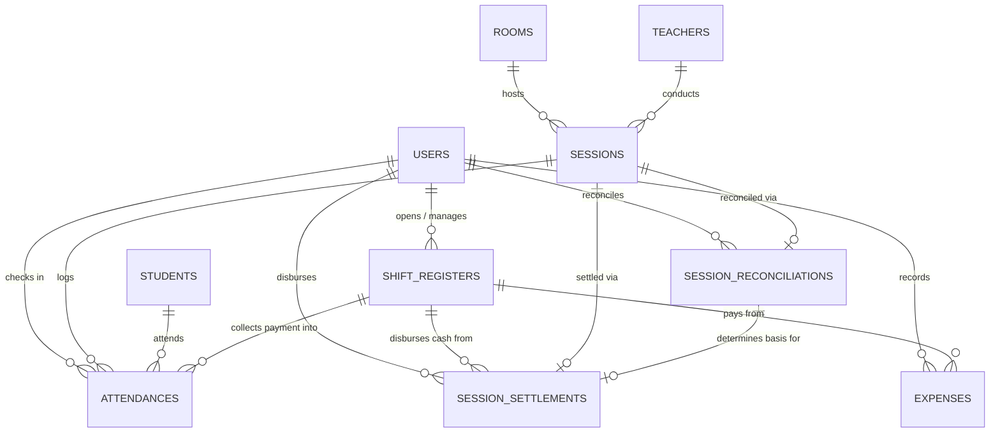

# Database Design Specification: Educational Center ERP

## 1. Overview & Architecture
This database schema is designed for Egyptian educational centers ("سناتر الدروس الخصوصية") based on the requirements in [idea.md](../idea.md) and [product.md](product.md). It mirrors the Prisma source of truth at `prisma/schema.prisma` and migrations `0001_init` + `0002_audit_logs`.

### Design Objectives
1. **Sub-Second Door Check-In:** High-speed lookup by phone, student code, or name to prevent lobby bottlenecks during rush hours.
2. **Concurrency & Double Check-In Guard:** Multiple receptionists working concurrently across separate desks cannot check in the same student twice for the same session.
3. **Rigid Financial Audit Trail:** Explicit separation of physical cash in register drawers vs. digital wallets (**Vodafone Cash** and **InstaPay**), coupled with teacher payout vouchers and end-of-session headcount reconciliation.
4. **Target Engine:** PostgreSQL 15+ only. The schema requires PostgreSQL-specific extensions (`pg_trgm`, `unaccent`, `pgcrypto`), `UUID` and `TIMESTAMPTZ` column types, JSONB, and the `postgresqlExtensions` preview feature; it is not compatible with SQLite.

---

## 2. Entity-Relationship (ER) Diagram



---

## 3. Data Dictionary & Table Schemas

### 3.1. `users` (Center Staff Accounts)
Stores center internal staff authentication and roles. Teachers and external assistants do **not** have accounts.

| Column | Type | Constraints | Description |
| :--- | :--- | :--- | :--- |
| `id` | `UUID` | `PK, DEFAULT gen_random_uuid()` | Unique staff identifier. |
| `username` | `VARCHAR(50)` | `UNIQUE, NOT NULL` | Login username. |
| `email` | `VARCHAR(100)` | `UNIQUE, NULL` | Optional email address. |
| `password_hash` | `VARCHAR(255)` | `NOT NULL` | Argon2id password hash. |
| `full_name` | `VARCHAR(100)` | `NOT NULL` | Display name (e.g., "أحمد محمود"). |
| `role` | `enum Role` | `NOT NULL` | System access tier — native enum `ADMIN` / `RECEPTIONIST`. |
| `phone_number` | `VARCHAR(20)` | `NULL` | Contact mobile number. |
| `preferred_language`| `VARCHAR(5)` | `DEFAULT 'ar', NOT NULL, CHECK (preferred_language IN ('ar', 'en'))` | User interface language preference (Arabic default). |
| `is_active` | `BOOLEAN` | `DEFAULT TRUE, NOT NULL` | Active status flag. |
| `created_at` | `TIMESTAMPTZ` | `DEFAULT NOW(), NOT NULL` | Creation timestamp. |
| `updated_at` | `TIMESTAMPTZ` | `DEFAULT NOW(), NOT NULL` | Last update timestamp. |

---

### 3.2. `rooms` (Classrooms & Lecture Halls)
Defines physical halls in the center with capacity limits.

| Column | Type | Constraints | Description |
| :--- | :--- | :--- | :--- |
| `id` | `UUID` | `PK, DEFAULT gen_random_uuid()` | Unique room identifier. |
| `name` | `VARCHAR(50)` | `NOT NULL, UNIQUE` | Hall name (e.g., "قاعة 1 (الكبرى)", "قاعة ب"). |
| `capacity` | `INTEGER` | `NOT NULL, CHECK (capacity > 0)` | Maximum student seat count. |
| `floor` | `VARCHAR(20)` | `NULL` | Floor number or location description. |
| `is_active` | `BOOLEAN` | `DEFAULT TRUE, NOT NULL` | Active flag. |
| `created_at` | `TIMESTAMPTZ` | `DEFAULT NOW(), NOT NULL` | Creation timestamp. |

---

### 3.3. `teachers` (Tutors)
External instructors who rent or conduct sessions in the center.

| Column | Type | Constraints | Description |
| :--- | :--- | :--- | :--- |
| `id` | `UUID` | `PK, DEFAULT gen_random_uuid()` | Unique teacher identifier. |
| `full_name` | `VARCHAR(100)` | `NOT NULL` | Teacher name (e.g., "أ/ محمد عبد الفتاح"). |
| `search_name` | `VARCHAR(100)` | `NOT NULL` | Pre-computed normalized Arabic name (feeds the trigram index and runtime search). |
| `phone_number` | `VARCHAR(20)` | `NOT NULL` | Primary mobile number. |
| `subject` | `VARCHAR(50)` | `NOT NULL` | Subject taught (e.g., "فيزياء", "لغة عربية", "رياضيات"). |
| `default_center_fee`| `DECIMAL(10, 2)`| `NOT NULL, CHECK (default_center_fee >= 0)` | Fixed center cut per attending student (EGP). |
| `assistant_name` | `VARCHAR(100)` | `NULL` | Name of primary in-hall assistant. |
| `assistant_phone`| `VARCHAR(20)` | `NULL` | Assistant contact phone. |
| `is_active` | `BOOLEAN` | `DEFAULT TRUE, NOT NULL` | Active status flag. |
| `created_at` | `TIMESTAMPTZ` | `DEFAULT NOW(), NOT NULL` | Creation timestamp. |

---

### 3.4. `students` (Student Master Directory)
Master registry of all students attending the center.

| Column | Type | Constraints | Description |
| :--- | :--- | :--- | :--- |
| `id` | `UUID` | `PK, DEFAULT gen_random_uuid()` | Unique student identifier. |
| `student_code` | `VARCHAR(30)` | `UNIQUE, NOT NULL` | Human-friendly code for search/barcode (auto-generated `STU-00001`, …). |
| `full_name` | `VARCHAR(150)` | `NOT NULL` | Full student name. |
| `search_name` | `VARCHAR(150)` | `NOT NULL` | Pre-computed normalized Arabic name (feeds the trigram index and runtime search). |
| `student_phone` | `VARCHAR(20)` | `NULL` | Student's personal phone number. |
| `guardian_phone`| `VARCHAR(20)` | `NOT NULL` | Parent / Guardian phone (critical for communication). |
| `academic_stage`| `VARCHAR(50)` | `NOT NULL` | Grade level (e.g., "SEC_3" / "الثالث الثانوي", "PREP_2"). |
| `school_type` | `VARCHAR(30)` | `DEFAULT 'GENERAL', NOT NULL` | 'GENERAL' (عام), 'LANGUAGES' (لغات), 'AZHAR' (أزهري). |
| `notes` | `TEXT` | `NULL` | Special medical, discount, or guardian notes. |
| `created_at` | `TIMESTAMPTZ` | `DEFAULT NOW(), NOT NULL` | Registration timestamp. |
| `updated_at` | `TIMESTAMPTZ` | `DEFAULT NOW(), NOT NULL` | Last update timestamp. |

---

### 3.5. `sessions` (Scheduled Class Instances)
Specific occurrences of a class in a hall.

| Column | Type | Constraints | Description |
| :--- | :--- | :--- | :--- |
| `id` | `UUID` | `PK, DEFAULT gen_random_uuid()` | Unique session identifier. |
| `teacher_id` | `UUID` | `FK -> teachers(id), NOT NULL` | Assigned tutor. |
| `room_id` | `UUID` | `FK -> rooms(id), NOT NULL` | Assigned classroom. |
| `title` | `VARCHAR(150)` | `NOT NULL` | Session title (e.g., "فصل 1 - فيزياء 3 ثانوي"). |
| `academic_stage`| `VARCHAR(50)` | `NOT NULL` | Grade level for this session. |
| `start_time` | `TIMESTAMPTZ` | `NOT NULL` | Scheduled session start time. |
| `end_time` | `TIMESTAMPTZ` | `NOT NULL, CHECK (end_time > start_time)` | Scheduled session end time. |
| `session_price` | `DECIMAL(10, 2)`| `NOT NULL, CHECK (session_price > 0)` | Per-student fee (e.g., 100.00 EGP). |
| `center_fee_per_student`| `DECIMAL(10, 2)`| `NOT NULL, CHECK (center_fee_per_student >= 0)` | Fixed center share per student (e.g., 20.00 EGP). |
| `status` | `VARCHAR(20)` | `DEFAULT 'SCHEDULED', NOT NULL, CHECK (status IN ('SCHEDULED', 'ACTIVE', 'COMPLETED', 'CANCELLED'))` | Current lifecycle state. |
| `created_by` | `UUID` | `FK -> users(id), NOT NULL` | Admin who scheduled the session. |
| `created_at` | `TIMESTAMPTZ` | `DEFAULT NOW(), NOT NULL` | Creation timestamp. |

---

### 3.6. `shift_registers` (Per-Desk Shift Cash Drawers)
Supports multi-receptionist concurrency. Each receptionist on duty operates an isolated named desk register session.

| Column | Type | Constraints | Description |
| :--- | :--- | :--- | :--- |
| `id` | `UUID` | `PK, DEFAULT gen_random_uuid()` | Unique shift register session ID. |
| `receptionist_id`| `UUID` | `FK -> users(id), NOT NULL` | Receptionist operating this station. |
| `desk_identifier`| `VARCHAR(50)` | `NOT NULL` | Desk name (e.g., "Desk 1", "Desk 2 - Main Gate"). |
| `opened_at` | `TIMESTAMPTZ` | `DEFAULT NOW(), NOT NULL` | Shift start timestamp. |
| `closed_at` | `TIMESTAMPTZ` | `NULL` | Shift close timestamp. |
| `opening_cash` | `DECIMAL(10, 2)`| `DEFAULT 0.00, NOT NULL` | Physical starting cash balance (EGP). |
| `actual_cash_counted`| `DECIMAL(10, 2)`| `NULL` | Physical cash counted at handover. |
| `expected_cash` | `DECIMAL(10, 2)`| `NULL` | Computed: Opening + Cash In - Cash Out. |
| `cash_variance` | `DECIMAL(10, 2)`| `NULL` | Difference: `actual_cash_counted` - `expected_cash`. |
| `status` | `VARCHAR(20)` | `DEFAULT 'OPEN', NOT NULL, CHECK (status IN ('OPEN', 'CLOSED'))` | Register status. |
| `closing_notes` | `TEXT` | `NULL` | Receptionist notes or explanations for variance. |

---

### 3.7. `attendances` (Door Check-In & Payment Records)
High-volume operational table. Records individual student arrivals and fee payments.

| Column | Type | Constraints | Description |
| :--- | :--- | :--- | :--- |
| `id` | `UUID` | `PK, DEFAULT gen_random_uuid()` | Unique check-in record ID. |
| `session_id` | `UUID` | `FK -> sessions(id), NOT NULL` | Attended session. |
| `student_id` | `UUID` | `FK -> students(id), NOT NULL` | Checked-in student. |
| `receptionist_id`| `UUID` | `FK -> users(id), NOT NULL` | Receptionist who processed the entry. |
| `shift_register_id`| `UUID` | `FK -> shift_registers(id), NOT NULL` | Specific desk drawer receiving the transaction. |
| `check_in_time` | `TIMESTAMPTZ` | `DEFAULT NOW(), NOT NULL` | Exact door timestamp. |
| `amount_paid` | `DECIMAL(10, 2)`| `NOT NULL, CHECK (amount_paid >= 0)` | Amount collected (matches session price). |
| `change_owed` | `DECIMAL(10, 2)`| `DEFAULT 0.00, NOT NULL, CHECK (change_owed >= 0)` | Change returned to the student when collected > fee (`calculateChangeOwed`). |
| `payment_method`| `VARCHAR(20)` | `NOT NULL, CHECK (payment_method IN ('CASH', 'VODAFONE_CASH', 'INSTAPAY'))` | Strictly one of the 3 payment options. |
| `payment_reference`| `VARCHAR(100)`| `NULL` | Wallet sender mobile or InstaPay transfer reference. |
| `status` | `VARCHAR(20)` | `DEFAULT 'PAID', NOT NULL, CHECK (status IN ('PAID', 'EXCUSED', 'VOID'))` | Attendance payment state. |

> **Concurrency Protection:**  
> Constraint `uq_attendance_session_student` (`UNIQUE (session_id, student_id)`, error code `23505` / Prisma `P2002`) guarantees that a student cannot be checked in twice for the same session across different reception desks.

---

### 3.8. `session_reconciliations` (Lobby vs. In-Hall Headcount)
Captures the roll-call verification submitted by the teacher's assistant versus the lobby register count.

| Column | Type | Constraints | Description |
| :--- | :--- | :--- | :--- |
| `id` | `UUID` | `PK, DEFAULT gen_random_uuid()` | Unique reconciliation record ID. |
| `session_id` | `UUID` | `FK -> sessions(id), UNIQUE, NOT NULL` | One reconciliation per session. |
| `lobby_count` | `INTEGER` | `NOT NULL, CHECK (lobby_count >= 0)` | Total paid attendees recorded by reception desk(s). |
| `assistant_count`| `INTEGER` | `NOT NULL, CHECK (assistant_count >= 0)` | Physical roll-call count from in-hall assistant. |
| `discrepancy` | `INTEGER` | `NOT NULL` | Computed: `assistant_count - lobby_count`. |
| `reconciled_headcount`| `INTEGER` | `NOT NULL, CHECK (reconciled_headcount >= 0)` | Final agreed count used for financial settlement. |
| `resolution_notes`| `TEXT` | `NULL` | Explanation if discrepancy exists and how resolved. |
| `reconciled_by` | `UUID` | `FK -> users(id), NOT NULL` | Staff member who performed reconciliation. |
| `reconciled_at` | `TIMESTAMPTZ` | `DEFAULT NOW(), NOT NULL` | Timestamp of reconciliation. |

---

### 3.9. `session_settlements` (Teacher Financial Payouts)
Financial closing record for a completed session.

| Column | Type | Constraints | Description |
| :--- | :--- | :--- | :--- |
| `id` | `UUID` | `PK, DEFAULT gen_random_uuid()` | Unique settlement voucher ID. |
| `session_id` | `UUID` | `FK -> sessions(id), UNIQUE, NOT NULL` | The settled session. |
| `reconciliation_id`| `UUID` | `FK -> session_reconciliations(id), NOT NULL` | Basis reconciliation record. |
| `disbursed_from_shift_id`| `UUID` | `FK -> shift_registers(id), NULL` | Desk drawer from which physical cash was disbursed. |
| `reconciled_headcount`| `INTEGER` | `NOT NULL` | Student count applied for payout. |
| `session_price` | `DECIMAL(10, 2)`| `NOT NULL` | Session admission price (EGP). |
| `center_fee_per_student`| `DECIMAL(10, 2)`| `NOT NULL` | Center cut per student (EGP). |
| `total_revenue` | `DECIMAL(10, 2)`| `NOT NULL` | `reconciled_headcount * session_price`. |
| `center_revenue`| `DECIMAL(10, 2)`| `NOT NULL` | `reconciled_headcount * center_fee_per_student`. |
| `teacher_payout`| `DECIMAL(10, 2)`| `NOT NULL` | `total_revenue - center_revenue`. |
| `payout_method` | `VARCHAR(20)` | `DEFAULT 'CASH', NOT NULL, CHECK (payout_method IN ('CASH', 'VODAFONE_CASH', 'INSTAPAY'))` | Method used to disburse teacher's money. |
| `recipient_name`| `VARCHAR(100)` | `NOT NULL` | Person who received funds (e.g., "أ/ وليد (المساعد)"). |
| `status` | `VARCHAR(20)` | `DEFAULT 'DISBURSED', NOT NULL, CHECK (status IN ('PENDING', 'DISBURSED'))` | Settlement payout status. |
| `created_by` | `UUID` | `FK -> users(id), NOT NULL` | Staff user issuing the settlement. |
| `settled_at` | `TIMESTAMPTZ` | `DEFAULT NOW(), NOT NULL` | Settlement timestamp. |

---

### 3.10. `expenses` (Petty Cash & Operating Outlays)
Tracks expenses disbursed from cash drawers or digital channels during a shift.

| Column | Type | Constraints | Description |
| :--- | :--- | :--- | :--- |
| `id` | `UUID` | `PK, DEFAULT gen_random_uuid()` | Unique expense ID. |
| `shift_register_id`| `UUID` | `FK -> shift_registers(id), NULL` | Desk drawer paying the expense (if cash). |
| `category` | `VARCHAR(50)` | `NOT NULL` | Free-text category label (e.g., "بوفيه", "أدوات", "صيانة"). Not an enum. |
| `amount` | `DECIMAL(10, 2)`| `NOT NULL, CHECK (amount > 0)` | Expense amount in EGP. |
| `payment_method`| `VARCHAR(20)` | `DEFAULT 'CASH', NOT NULL, CHECK (payment_method IN ('CASH', 'VODAFONE_CASH', 'INSTAPAY'))` | Payment method used. |
| `description` | `VARCHAR(255)` | `NOT NULL` | Detailed explanation of outlay. |
| `created_by` | `UUID` | `FK -> users(id), NOT NULL` | Staff member logging the expense. |
| `created_at` | `TIMESTAMPTZ` | `DEFAULT NOW(), NOT NULL` | Expense timestamp. |

---

### 3.11. `audit_logs` (Operational Audit Trail)
Appended by migration `0002_audit_logs`. Every financial mutation is audited inside the same transaction that performs it. Actions recorded in production code: `SHIFT_OPENED`, `SHIFT_CLOSED`, `ATTENDANCE_CHECKED_IN`, `EXPENSE_RECORDED`, `SESSION_RECONCILED`, `TEACHER_PAYOUT`.

| Column | Type | Constraints | Description |
| :--- | :--- | :--- | :--- |
| `id` | `UUID` | `PK, DEFAULT gen_random_uuid()` | Unique audit entry ID. |
| `shift_register_id`| `UUID` | `FK -> shift_registers(id), NULL` | Desk register context, when applicable. |
| `actor_id` | `UUID` | `FK -> users(id), NOT NULL` | Staff member who performed the action. |
| `action` | `VARCHAR(50)` | `NOT NULL` | Action enum string (see list above). |
| `entity_type` | `VARCHAR(50)` | `NOT NULL` | Affected entity (e.g., `session`, `attendance`, `shift_register`, `session_settlement`, `expense`). |
| `entity_id` | `UUID` | `NULL` | Affected record. |
| `amount` | `DECIMAL(10, 2)`| `NULL` | Financial amount involved, when applicable. |
| `metadata` | `JSONB` | `NULL` | Extra context (student name, payment reference, desk, etc.). |
| `created_at` | `TIMESTAMPTZ` | `DEFAULT NOW(), NOT NULL` | Audit timestamp. |

Indexes: `(shift_register_id, created_at)`, `(created_at)`. Query paths: `GET /api/reports/shifts/:shiftId/audit` and the daily report.

---

## 4. High-Performance Indexing Strategy

During door rushes (100+ students in 15 minutes across concurrent desks), query execution must stay under **15 milliseconds**.

The extensions, `normalize_arabic()` function, GIN trigram indexes, core indexes below are all created by migration `0001_init`; the audit-log indexes come from `0002_audit_logs`. Full DDL: `prisma/migrations/0001_init/migration.sql` and `prisma/migrations/0002_audit_logs/migration.sql`.

```sql
-- 0. Extensions (created by migration 0001_init)
CREATE EXTENSION IF NOT EXISTS pg_trgm;
CREATE EXTENSION IF NOT EXISTS unaccent;
CREATE EXTENSION IF NOT EXISTS pgcrypto;

-- 1. Arabic phonetic normalization (mirrors src/shared/utils/arabicNormalization.ts):
--    strips tashkeel + tatweel, unifies أ/إ/آ -> ا, ة -> ه, ى -> ي, collapses spaces, lowercased
CREATE OR REPLACE FUNCTION normalize_arabic(input_text TEXT)
RETURNS TEXT AS $$
  SELECT lower(
    regexp_replace(
      regexp_replace(
        regexp_replace(
          regexp_replace(
            regexp_replace(COALESCE(input_text, ''), '[\u064B-\u065F\u0670]', '', 'g'),
            '[أإآا]', 'ا', 'g'
          ),
          'ة', 'ه', 'g'
        ),
        'ى', 'ي', 'g'
      ),
      '\s+', ' ', 'g'
    )
  );
$$ LANGUAGE plpgsql IMMUTABLE;

-- 1.1 GIN trigram indexes on normalized names (fuzzy Arabic matching)
CREATE INDEX idx_students_name_trgm ON students USING gin (normalize_arabic(full_name) gin_trgm_ops);
CREATE INDEX idx_teachers_name_trgm ON teachers USING gin (normalize_arabic(full_name) gin_trgm_ops);

-- 1.2 Pre-computed search_name columns (fed by the application, NOT SQL GENERATED)
CREATE INDEX idx_students_search_name ON students (search_name);
CREATE INDEX idx_teachers_search_name ON teachers (search_name);

-- 1.3 Student master directory fast lookups (code, phones)
CREATE INDEX idx_students_code           ON students (student_code);
CREATE INDEX idx_students_phone          ON students (student_phone);
CREATE INDEX idx_students_guardian_phone ON students (guardian_phone);

-- 2. Active & starting-soon sessions filter (Reception dashboard)
CREATE INDEX idx_sessions_active ON sessions (status, start_time, end_time)
WHERE status IN ('SCHEDULED', 'ACTIVE');

-- 3. Concurrency Guard: enforces 1 check-in per student per session
CREATE UNIQUE INDEX uq_attendance_session_student ON attendances (session_id, student_id);

-- 4. Session attendance headcount & check-in history
CREATE INDEX idx_attendances_session       ON attendances (session_id);
CREATE INDEX idx_attendances_student       ON attendances (student_id);
CREATE INDEX idx_attendances_shift_payment ON attendances (shift_register_id, payment_method);

-- 5. Open shift register lookup by receptionist
CREATE INDEX idx_shift_registers_open ON shift_registers (receptionist_id, status) WHERE status = 'OPEN';

-- 6. Financial/audit FK lookups (migration 0001 + 0002)
CREATE INDEX idx_session_reconciliations_session ON session_reconciliations (session_id);
CREATE INDEX idx_session_settlements_session     ON session_settlements (session_id);
CREATE INDEX idx_session_settlements_shift       ON session_settlements (disbursed_from_shift_id);
CREATE INDEX idx_expenses_shift                  ON expenses (shift_register_id);
CREATE INDEX idx_audit_logs_shift_created        ON audit_logs (shift_register_id, created_at);
CREATE INDEX idx_audit_logs_created              ON audit_logs (created_at);
```

> **Runtime note:** The API performs student/teacher search with Prisma `contains` / `mode: "insensitive"` against the pre-computed `search_name` columns (btree), wrapped in an OR that also covers code and phones. The SQL `normalize_arabic()` + GIN trigram indexes remain available for even more robust fuzzy matching and DBA tuning.

---

## 5. Migration, Backup, and Restore Operations

### Local database setup

1. Install Docker Desktop with Compose support and copy `.env.example` to `.env`.
2. Set a local PostgreSQL password in `DATABASE_URL` and start PostgreSQL:

```powershell
npm run docker:up
npm run db:migrate:deploy
npm run db:seed
```

3. Verify migration state:

```powershell
npm run db:migrate:status
npx prisma validate
npx prisma generate
```

For a disposable development database only, use `npm run db:reset`. Never run it against production.

### Production migration

Deploy the application with `NODE_ENV=production`, a production `DATABASE_URL`, and run `npm run db:migrate:deploy`. Production must use `prisma migrate deploy`; `prisma migrate dev`, `prisma db push`, and `prisma migrate reset` are development-only operations.

### PostgreSQL backup

Create a compressed logical backup from a machine with PostgreSQL client tools installed:

```powershell
pg_dump --format=custom --no-owner --file=edu_center_erp_YYYYMMDD.dump "$env:DATABASE_URL"
```

Store backups outside the application host, restrict access to authorized administrators, and retain multiple dated copies.

### PostgreSQL restore

Restore into a new empty database first, then verify the application and migration state before any cutover:

```powershell
createdb edu_center_erp_restore
pg_restore --clean --if-exists --no-owner --dbname=edu_center_erp_restore edu_center_erp_YYYYMMDD.dump
```

After restore, run `npx prisma migrate status`, verify the audit-log table and constraints, and perform a smoke test of login, check-in, settlement, and shift close. Do not restore over the live database without an approved maintenance window and a fresh rollback backup.

### Seed security

The development seed uses demo-only fallback passwords. Production seeding requires `SEED_ADMIN_PASSWORD` and `SEED_RECEPTIONIST_PASSWORD`; the seed does not print passwords. Change both accounts immediately after first production login.

## 6. Key Financial Calculations (SQL Reference)

### 6.1. Session Reconciliation & Split
```sql
SELECT 
    s.id AS session_id,
    s.title,
    t.full_name AS teacher_name,
    s.session_price,
    s.center_fee_per_student,
    r.reconciled_headcount,
    (r.reconciled_headcount * s.session_price) AS total_revenue,
    (r.reconciled_headcount * s.center_fee_per_student) AS center_revenue,
    (r.reconciled_headcount * (s.session_price - s.center_fee_per_student)) AS teacher_payout
FROM sessions s
JOIN teachers t ON s.teacher_id = t.id
JOIN session_reconciliations r ON r.session_id = s.id
WHERE s.id = :session_id;
```

### 6.2. Desk Cash Drawer Shift Expected Balance
```sql
SELECT 
    sr.id AS shift_id,
    sr.desk_identifier,
    sr.opening_cash,
    -- Cash Collected at this desk
    COALESCE(SUM(CASE WHEN a.payment_method = 'CASH' THEN a.amount_paid ELSE 0 END), 0) AS total_cash_in,
    -- Digital Collections logged at this desk
    COALESCE(SUM(CASE WHEN a.payment_method = 'VODAFONE_CASH' THEN a.amount_paid ELSE 0 END), 0) AS total_vodafone_cash,
    COALESCE(SUM(CASE WHEN a.payment_method = 'INSTAPAY' THEN a.amount_paid ELSE 0 END), 0) AS total_instapay,
    -- Cash Payouts to teachers disbursed from this desk drawer
    COALESCE((SELECT SUM(ss.teacher_payout) FROM session_settlements ss WHERE ss.disbursed_from_shift_id = sr.id AND ss.payout_method = 'CASH'), 0) AS total_teacher_cash_payouts,
    -- Petty Cash expenses disbursed from this desk drawer
    COALESCE((SELECT SUM(e.amount) FROM expenses e WHERE e.shift_register_id = sr.id AND e.payment_method = 'CASH'), 0) AS total_cash_expenses,
    -- Final Expected Physical Cash in Drawer
    (sr.opening_cash 
     + COALESCE(SUM(CASE WHEN a.payment_method = 'CASH' THEN a.amount_paid ELSE 0 END), 0)
     - COALESCE((SELECT SUM(ss.teacher_payout) FROM session_settlements ss WHERE ss.disbursed_from_shift_id = sr.id AND ss.payout_method = 'CASH'), 0)
     - COALESCE((SELECT SUM(e.amount) FROM expenses e WHERE e.shift_register_id = sr.id AND e.payment_method = 'CASH'), 0)
    ) AS expected_physical_cash
FROM shift_registers sr
LEFT JOIN attendances a ON a.shift_register_id = sr.id AND a.status = 'PAID'
WHERE sr.id = :shift_id
GROUP BY sr.id;
```
