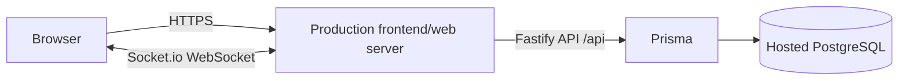

# Deployment Guide: Educational Center ERP

Deploy a single HTTPS web service (frontend + Fastify API + Socket.io) connected to a hosted PostgreSQL database. The project ships with a ready-to-use blueprint for [Render](https://render.com) (`render.yaml`) and state is documented in the README and `docs/progress.md`.

> **Operations (backup, restore, rollback, staging simulation, verification checklist) live in [`docs/runbook.md`](runbook.md).** This guide covers configuration; the runbook covers day-to-day operations and recovery.

## 1. Target Architecture



- **Single-service deployment (recommended):** Fastify serves the built SPA (`@fastify/static` from `dist/`) **and** the `/api` REST routes **and** the `/socket.io` WebSocket endpoint on one HTTPS origin. The browser talks to the same origin, so no CORS issues and cookies just work.
- **Split deployment (optional):** the SPA is hosted separately from the API. The client reads `VITE_API_BASE_URL` / `VITE_SOCKET_URL` at build time (baked into the bundle) and credentials are sent cross-origin (cookie requires `credentials: 'include'`; server requires `CORS_ORIGIN` to list the exact frontend origin).

## 2. Environment Variables (production)

| Variable | Required | Meaning |
| :--- | :--- | :--- |
| `NODE_ENV` | yes | Must be `production`. Enables secure cookies, built-in static serving, info-level logging. |
| `DATABASE_URL` | yes | Full PostgreSQL connection string (e.g. Supabase private URL). The app refuses to start without it. |
| `JWT_SECRET` | yes | Long random token-signing secret (e.g. 64+ random bytes hex). Generate once, store in the host's secret settings. |
| `COOKIE_SECRET` | yes | Long random cookie-signing secret. Generate once, store as a secret. |
| `CORS_ORIGIN` | yes | Comma-separated list of allowed browser origins. Set to the public app URL even for same-origin deployments. |
| `JWT_EXPIRES_IN` | no | Session lifetime, e.g. `12h` (default), `8h`, `1d`. Must be >= 1s; the cookie `maxAge` follows it. |
| `PORT` | no | HTTP port the server binds (default `3000`). Hosting providers usually inject this. |
| `DEFAULT_LOCALE` | no | `ar` (default) or `en`. |
| `REQUEST_BODY_LIMIT_KB` / `SOCKET_MAX_PAYLOAD_KB` | no | Request/socket payload caps (default `64` KB). |
| `RATE_LIMIT_*` | no | Per-endpoint rate limits (login/checkin/search/financial). In-memory per process. |
| `SEED_ADMIN_PASSWORD` / `SEED_RECEPTIONIST_PASSWORD` | seed only | Required if you run `npm run db:seed` against production; the seed refuses to run in production without them. |
| `VITE_API_BASE_URL` / `VITE_SOCKET_URL` | build only | Absolute API/WebSocket base URLs for **split hosting**. Set at build time; leave unset for single-service. |

> Rules guaranteed by code:
> - **No production fallback secrets.** `config/index.ts` throws on startup when `DATABASE_URL`, `JWT_SECRET`, `COOKIE_SECRET`, or `CORS_ORIGIN` are missing in `NODE_ENV=production`. Development-only defaults are used solely outside production and print warnings.
> - **No secrets in the repository.** `.env` and `*.local` are git-ignored; only `.env.example` (with placeholders) is tracked. `render.yaml` uses `generateValue: true` and `sync: false` so secrets live in the host's secret store.
> - **Cookies** are HTTP-only, signed, `SameSite=Lax`, and `Secure` in production.
> - **Logs** never print secrets: cookie/authorization headers and passwords are redacted; startup logs print port/environment/origins only.

## 3. Build, Migrate & Launch

Requirements: Node.js 20+ and a PostgreSQL 15+ instance (hosted or `docker-compose.yml` for local).

```powershell
# 1. Install dependencies from the lockfile
npm ci --include=dev        # (render buildCommand)

# 2. Generate & validate the Prisma client
npm run db:generate         # prisma generate
npx prisma validate

# 3. Build the client and the server
npm run build:production   # prisma generate  +  tsc -b && vite build  +  tsc -p tsconfig.server.json

# 4. Apply migrations against the production database
npm run start:production    # prisma migrate deploy && node dist/server/server/server.js

# 5. Verify
#    GET /api/health  -> 200 {"success":true,"data":{"status":"ok","database":"ok",...}}
```

`npm run start:production` runs `prisma migrate deploy` (the only safe production migration command) and then starts the server. On Render this is wired via `healthCheckPath: /api/health`.

## 4. Health & Shutdown

- **Health:** `GET /api/health` (public) performs `SELECT 1` against PostgreSQL. Returns `200 ok` or `503 DATABASE_UNAVAILABLE`, and includes `system`, `environment`, `defaultLocale`, `timestamp` — no secrets.
- **Graceful shutdown:** on `SIGTERM`/`SIGINT` the server closes Socket.io, drains Fastify connections, disconnects Prisma, and exits. A 10-second force-exit timer prevents hung deploys.

## 5. First-Seed an Empty Production Database

```powershell
$env:SEED_ADMIN_PASSWORD = "<long-random>"
$env:SEED_RECEPTIONIST_PASSWORD = "<long-random>"
npm run db:seed
```

The seed creates `admin` and `reception1` with the supplied passwords (dev demo defaults are rejected in production). Change them after first login if they were ever exposed.

## 6. Production Verification Checklist

- [ ] `NODE_ENV=production` and the four required variables are set in the host (not in a committed file). *(Verified locally: startup fails fast with exit 1 and "…required in production." when they are missing.)*
- [x] `npm ci --include=dev` succeeds from a clean checkout (lockfile in the repo).
- [x] `npm run build:production` succeeds and produces `dist/` (client + 133 backend / 25 frontend tests green after the clean install).
- [ ] `prisma migrate deploy` applies all migrations (`0001_init`, `0002_audit_logs`).
- [ ] `/api/health` returns `200` and `database: "ok"`.
- [ ] Login over HTTPS sets a `Secure`, HTTP-only cookie.
- [ ] Check-in from two desks keeps lobby counts in sync (Socket.io upgrade works through the host). *(WebSocket transport upgrade verified locally against the production build; unauth clients are rejected with `unauthorized`.)*
- [ ] A browser opened at the public URL loads the SPA with no CORS/WebSocket errors.
- [ ] The laptop that built the app is irrelevant — the service runs on the host.

## 7. Troubleshooting

| Symptom | Likely cause / fix |
| :--- | :--- |
| Startup aborts with "…required in production." | Missing `DATABASE_URL` / `JWT_SECRET` / `COOKIE_SECRET` / `CORS_ORIGIN`. Set them in the host's env/secret store. |
| WebSocket never connects / socket falls back to polling | The configured `CORS_ORIGIN` does not match the browser origin visiting the app, or the host blocks upgrade requests. Add the exact origin (protocol + host + port) and allow WebSocket upgrades. |
| CORS error on API calls | Frontend origin not in `CORS_ORIGIN`, or `VITE_API_BASE_URL` mismatched with the API host in a split deployment. |
| Cookie not sent/accepted | Host must be HTTPS in production; the cookie is `Secure`. |
| `/api/health` returns 503 | Database unreachable — check `DATABASE_URL`, network rules, and that the Supabase/DB host allows connections. |
| Session ends too early / too late | Adjust `JWT_EXPIRES_IN`; log out and log in again after a change. |