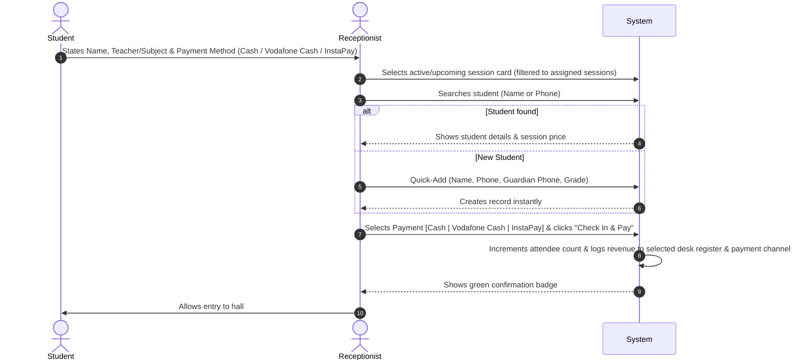
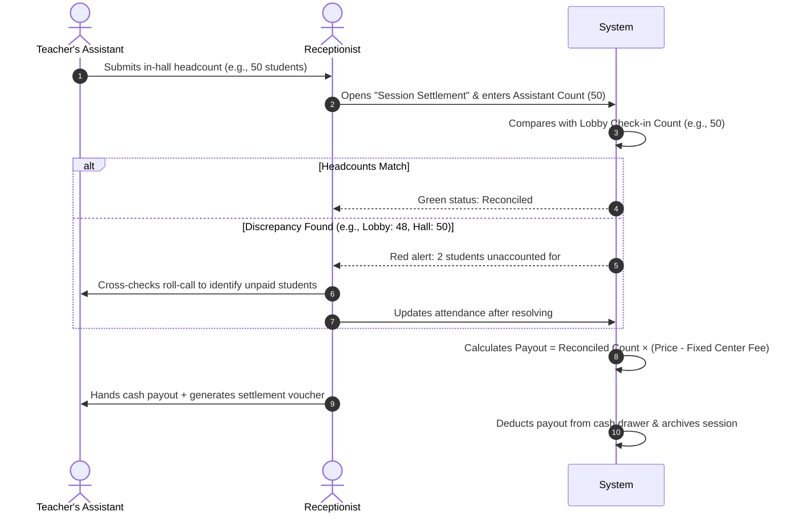

# Product Specification: Educational Center ERP (Egypt)

## 1. Executive Summary & Main Goal
Educational centers ("سناتر") in Egypt represent a fast-paced tutoring hub environment where hundreds of students arrive within narrow time windows between sessions. Currently, most centers rely on paper records, manual ledger notebooks, and fragmented communication, causing lobby congestion, lost revenue, scheduling conflicts, and inaccurate financial splits with tutors.

**Main Goal:**  
To deliver a fast, reliable, localized ERP system tailored for Egyptian educational centers that eliminates manual paperwork, accelerates lobby check-in, manages room schedules and teacher allocations, and automates multi-party financial accounting (per-student center fee vs. teacher payout, daily cash drawers, and headcount reconciliation between lobby reception and in-hall teacher assistants).

---

## 2. Target Users & Market Context
- **Target Center Profile:** Independent Egyptian educational centers ("سناتر الدروس الخصوصية") offering tutoring across Primary, Preparatory, and Secondary (Thanaweya Amma) stages.
- **Operational Reality:**
  - Cash-heavy transactions collected **per-session at the door**.
  - Teacher assistants operate inside the classroom taking physical roll-call.
  - High-traffic rush hours (between 12:00 PM and 8:00 PM) where dozens of students enter within minutes.
  - Fixed-fee revenue model: The center earns a fixed amount per student per session (e.g., 25 EGP/student), and the remainder is disbursed to the tutor.

---

## 3. Problem Being Solved

| Existing Manual Challenge | ERP Solution |
| :--- | :--- |
| **Lobby Bottlenecks & Multi-Session Overload:** Receptionists manually scanning paper lists as 50+ students arrive at once across multiple simultaneous classes. | Instant session switcher and **Concurrent Multi-Desk Check-in**: Multiple receptionists handle dedicated session subsets simultaneously (e.g., Desk 1 handles 3 sessions, Desk 2 handles 3 sessions) with real-time live sync. |
| **Attendance Discrepancies & Hall Slip-ins:** Students entering classrooms without paying at the desk, or discrepancies between lobby records and actual hall attendees. | Formal Headcount Reconciliation feature comparing Lobby Check-in Count with Teacher Assistant's In-Hall Count before payout. |
| **Financial Leakage & Manual Splits:** Calculating teacher share by hand using pen and paper per session. | Automated calculation: Total Attendance × Session Price, subtracting (Total Attendance × Center Fixed Fee) to yield exact Teacher Payout. |
| **Cash Control & Shift Discrepancies:** Unreconciled cash drawers at the front desk when shifts change or payouts are disbursed. | Shift-based cash register tracking with opening balance, collected fees, cash disbursed to teachers, petty cash, and end-of-shift reconciliation. |
| **Lack of Student & Parent Traceability:** No reliable attendance history or parent emergency contact records when a student misses class. | Centralized student registry with guardian phone numbers, grade levels, and attendance logs. |
| **Hall & Scheduling Clashes:** Overlapping hall reservations and double-booked rooms for popular teachers. | Visual room and teacher calendar preventing overlapping hall assignments. |
| **Language Barrier & Foreign ERP Clutter:** Generic ERP systems in English or unnatural translations confuse receptionists and slow down fast-paced door entry. | **Native Arabic-First Interface (RTL)**: Designed from the ground up for Egyptian center culture, using familiar terminology (سناتر، حصص، بوفيه، ملازم، تصفية حساب), Arabic typography, and phonetic Arabic search normalization. |

---

## 4. User Roles & Permissions

> [!NOTE]
> System accounts are strictly internal to center staff. Teachers and their personal assistants do not have ERP accounts; they interact with center staff as external counterparties during session wrap-up.

### 4.1. Center Owner / General Manager (Admin)
- **Permissions:** Full system access.
- **Key Responsibilities:** Configure rooms, teacher fixed-fee rules per session, view aggregated financial P&L, review shift settlement reports.
- **Staff account management note:** There is currently **no staff (user) management screen** — staff accounts are created by the seed script (`prisma/seed.ts`) and, in production, via `SEED_ADMIN_PASSWORD` / `SEED_RECEPTIONIST_PASSWORD`. A user-management UI is planned.

### 4.2. Receptionist / Front Desk Staff
- **Concurrent Logins & Station Identification:** Multiple receptionists can be logged in concurrently on separate desk terminals (e.g., Desk 1, Desk 2). Each operates an individual named shift drawer session.
- **Permissions:** Lobby check-in screen, session workload filtering, student search & quick-add, per-session payment collection, end-of-session headcount reconciliation with teacher assistants, logging teacher cash payouts and minor center expenses, and individual shift drawer closing.
- **Restrictions:** Cannot alter default center split fees, modify past locked shifts, or delete historical transaction records.

---

## 5. Core Features

### 5.1. Lobby & Fast Check-in System (Primary Operational Hub)
- **Live Session Dashboard:** Automatically displays "Currently Active Sessions" and "Starting Soon (< 30 min)" cards displaying Teacher Name, Subject, Grade Level, Room, Session Price, and Live Headcount.
- **Multi-Desk Concurrent Workload Splitting:**
  - **Dynamic Session Filtering:** When 4 to 8+ sessions run simultaneously during peak rush hours, receptionists can divide the queue (e.g., Receptionist A selects and handles 3 sessions; Receptionist B handles the other 3 sessions).
  - **Omni-Search & Fallback:** If a student approaches the "wrong" desk, the receptionist can toggle filters instantly or search across all active sessions to prevent redirecting students to another queue.
  - **Real-Time Live Synchronization:** All desk stations remain synchronized in real-time to avoid duplicate check-ins and ensure live hall headcounts are consistent across screens.
- **Rapid Student Check-In:**
  - Instant search by student name, phone number, or student ID.
  - **Quick-Add Student:** Add a new student on-the-fly (Full Name, Phone, Guardian Phone, Academic Grade) from the Student Registry screen in under 10 seconds; quick-add is implemented on the Students page (not a lobby modal).
- **Instant Door Payment (3 Payment Options Only):** Collects the per-session fee at the door and marks the student as "Present & Paid". The system supports strictly three payment methods:
  1. **Cash:** Physical cash received into the lobby register drawer (default).
  2. **Vodafone Cash:** Mobile wallet transfer (logs transaction / sender phone number).
  3. **InstaPay:** Instant bank transfer (logs transaction reference / account name).

### 5.2. In-Hall Headcount Reconciliation Engine
- At session conclusion, the receptionist inputs the physical student count provided by the Teacher's Assistant.
- The system compares:
  - **Lobby System Count** (students checked in and paid at desk).
  - **Assistant Roll-Call Count** (students physically seated inside).
- **Discrepancy Resolution:** Highlights mismatches (e.g., Assistant counted 62, Receptionist checked in 60 = 2 unpaid students in hall). Receptionist and assistant reconcile before closing the session.

### 5.3. Teacher & Schedule Management
- **Teacher Profiles:** Teacher name, subjects taught, academic stages, contact number, and agreed **Fixed Center Fee per Student** (e.g., 20 EGP or 25 EGP).
- **Hall / Room Management:** Room identifiers, seating capacities, and equipment.
- **Session Timetable:** Weekly recurring schedule + ad-hoc/revision sessions with assigned hall, time slot, student admission price, and center cut.

### 5.4. Student Registry
- Student master profile: Full name, academic year/grade, school type (General / Languages / Azhar), student mobile, parent/guardian mobile, and enrolled subjects.
- Attendance history: Log of every session attended with timestamp, teacher name, and payment status.

### 5.5. Multi-Channel Payment Tracking & Cash Drawer Settlement
- **Session Settlement:**
  - $\text{Total Revenue} = \text{Reconciled Students} \times \text{Session Price}$
  - $\text{Center Share} = \text{Reconciled Students} \times \text{Fixed Center Fee}$
  - $\text{Teacher Payout} = \text{Total Revenue} - \text{Center Share}$
- **Payment Method Breakdown per Session & Shift:**
  - **Physical Cash:** Collected in desk drawer; funds physical cash payouts to teachers.
  - **Vodafone Cash:** Digital wallet collection log (tracks sender phone / transfer reference).
  - **InstaPay:** Instant bank collection log (tracks reference ID / account name).
- **Payout Disbursement:** Receptionist logs the payout handed to the teacher/assistant (recording disbursement method: Cash or digital transfer). The system returns a server-computed settlement record. Printable payout vouchers are **planned**, not yet implemented.
- **Daily Register & Multi-Desk Shift Closing:**
  - **Per-Desk Isolated Drawers:** In multi-receptionist setups, each desk/terminal maintains its own shift register session (e.g., Desk 1 [Mohamed], Desk 2 [Fatma]).
  - Separately tallies per desk:
    1. **Physical Cash in Drawer:** $\text{Starting Cash} + \text{Desk Cash Collections} - \text{Desk Cash Payouts} - \text{Desk Petty Cash}$.
    2. **Digital Collections:** Total Vodafone Cash and InstaPay collected at this desk.
  - **Aggregated Shift Summary:** Manager can review combined totals across all active desks or drill down per receptionist.

### 5.6. Reporting & Analytics
- Session settlement sheets (Date, Teacher, Subject, Headcount, Gross Collected by Payment Method, Center Cut, Teacher Payout).
- Daily cash drawer audit log and digital payments audit log per receptionist desk.
- Student attendance records per teacher and subject.

### 5.7. Arabic-First Interface & Localization (الواجهة العربية والتعريب الكامل)
- **Native Right-to-Left (RTL) Layout:**
  - Entire user interface default is RTL, mirroring natural Arabic reading and data entry patterns.
  - Directional alignment for forms, tables, modals, drawer sidebars, and keyboard navigation.
  - Instant language switcher in the header (Arabic primary default / English secondary). Note: the switch is applied app-wide for the browsing session; there is **no per-account persistence endpoint** yet.
- **Culturally Tailored Terminology & Typography:**
  - Employs standard Egyptian tutoring center vernacular: "تسجيل حضور سريع", "تصفية الحصة", "تقفيل الوردية", "عهد ودرج الكاش", "حساب السنتر", "نسبة المدرس", "مساعد المدرس", "سحب بوفيه ومصاريف".
  - Arabic web typography using the Google **Cairo** font, optimized for rapid legibility on desktop monitors and POS screens.
- **Phonetic Arabic Search Normalization:**
  - Door search engine tolerates common Arabic typing variations (e.g., `أ / إ / آ / ا`, `ة / ه`, `ى / ي`, and automatic diacritics/tashkeel stripping) so receptionists locate students in < 15ms without typing exact Hamzas.
- **Localized Printing & Documents (planned, not implemented):**
  - Arabic thermal vouchers for student admission receipts and teacher payout settlement vouchers (إيصال سداد حصة / كشف محاسبة وتصفية مدرس).
  - Egyptian currency display formatting: `120.00 ج.م` or `120.00 EGP`, with standard Arabic or Western digits based on center preference.

---

## 6. Important Workflows

### Workflow 1: Rapid Student Door Check-in

### Workflow 2: End-of-Session Headcount Reconciliation & Teacher Payout

### Workflow 3: End-of-Shift Cash Drawer Handover (Per Desk)
1. Receptionist at Desk X clicks "Close Shift".
2. System computes expected physical cash for that specific desk:
   $$\text{Expected Cash} = \text{Starting Cash} + \sum \text{Physical Cash Collections} - \sum \text{Cash Payouts} - \sum \text{Petty Cash}$$
3. System also summarizes total Vodafone Cash and InstaPay digital receipts collected at this desk.
4. Receptionist enters actual physical cash counted in their drawer.
5. System logs any variance (overage/shortage) and creates a locked desk shift report for Admin review.

---

## 7. MVP Scope (Phase 1)

The MVP is laser-focused on resolving the door rush and eliminating financial disputes:

- [x] **Internal Staff Authentication:** Admin and Receptionist role accounts.
- [x] **Multi-Desk Concurrent Check-In & Workload Splitting:**
  - Support 2+ receptionists working simultaneously during peak rush.
  - Dynamic session filtering per desk (e.g., Desk 1 operates 3 sessions, Desk 2 operates 3 sessions).
  - Live data sync across desks to prevent duplicate check-ins.
  - Dedicated per-desk cash drawer tracking and shift closing.
- [x] **Teacher & Session Scheduling:**
  - Teacher registry with **Fixed Center Fee per Student** (in EGP).
  - Hall schedule with session times and student admission prices.
- [x] **Lobby Fast Check-In Screen:**
  - Active & upcoming session selector with desk filter.
  - Student search & 10-second Quick-Add.
  - 1-click attendance with **3 payment options: Cash, Vodafone Cash, or InstaPay**.
- [x] **Headcount Reconciliation Modal:**
  - Input field for Teacher Assistant's in-hall count.
  - Instant discrepancy check against lobby count.
  - Finalized student count confirmation.
- [x] **Automated Session Financial Settlement:**
  - Formula: $\text{Reconciled Count} \times \text{Fixed Fee} = \text{Center Cut}$; remainder = Teacher Payout.
  - Log payout transaction (Cash or electronic).
- [x] **Shift Financial Register:**
  - Physical drawer cash reconciliation per desk (Opening + Cash In - Cash Out = Expected Cash).
  - Shift digital wallet totals (Vodafone Cash & InstaPay audit).
- [x] **Arabic-First Interface & RTL Localization:**
  - Full native RTL layout across all screens, modals, and tables.
  - Arabic typography (Cairo font) and authentic Egyptian tutoring center terminology.
  - Arabic phonetic search normalization (Alef, Taa Marbouta, Yaa variations).
  - Dual-language toggle (Arabic default, English optional).
- [ ] **Localized printable thermal vouchers in Arabic** (student check-in receipt & teacher payout voucher) — planned; printing is not implemented (see Roadmap Phase 2).

---

## 8. Future Roadmap (Post-MVP)

### Phase 2: Speed & Hardware Integrations
- **Student Barcode / QR ID Cards:** Instant scanning at door check-in to process students in < 2 seconds.
- **Thermal Receipt Printer:** Automatic mini voucher printout for the student and teacher payout slip.

### Phase 3: Parent Communication & Notifications
- **Automated WhatsApp Alerts (Arabic):** Instant localized Arabic message to guardian upon student check-in ("تم بحمد الله حضور ابنكم/ابنتكم حصة الفيزياء مع الأستاذ/ محمد في تمام الساعة 04:15 م") or absence alert ("نحيطكم علماً بغياب الطالب عن موعد الحصة").
- **SMS Gateway:** Local Egyptian SMS gateway integration with Arabic text templates for guardians without WhatsApp.

### Phase 4: Center Expansion & Value-Added Services
- **Study Booklets & Materials (المذكرات) Inventory:** Track printing costs, selling prices, and stock levels at the front desk.
- **Automated Payment Verification:** Direct API / webhook integration for instant SMS/push confirmation for InstaPay & Vodafone Cash transfers.
- **Multi-Branch Dashboard:** Unified dashboard for center owners operating across multiple locations.
